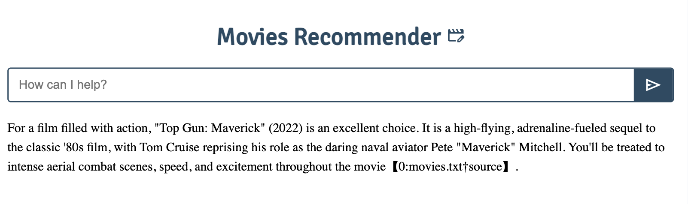

Simple AI Movie Recommender Chat

- App created for learning and experimenting with OpenAI Assistant API
- Uses a text file with a list of movies and description to create a vector store to feed to the agent as tool resource using file_search (done in the Node.js file). This process will split the text and create vector embeddings of each chunk.
- We create a main thread
- Once the setup with the file retrieval and the thread are ready we wait for user input and update the created thread with user messages and run the thread waiting for the assistant response which will be rendered to the DOM
- Written in JS, HTML & CSS
- Mockup Inspired by Online Course

  ***

  To run the app you need:

- OpenAI API Key in .env file

Mockup


---

Project setup

Intall all dependencies

```
npm install
```

1. Run projectSetupNode.js to get in the console the assistant id and the thread id just created

```
node projectSetupNode.js
```

```
ex:
   assistant id: asst_HUQ0W...
   thread id: thread_UOnp...
```

2. past the assistant id and thread id just logged in the console inside the file assistantmain.js in variables asstID and threadID

3. Run the project with Parcel

```
npm start
```
